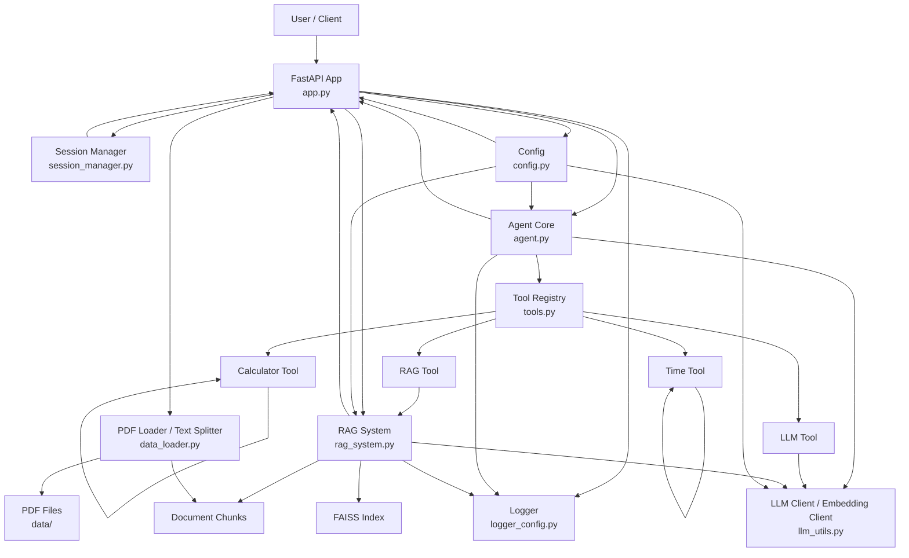
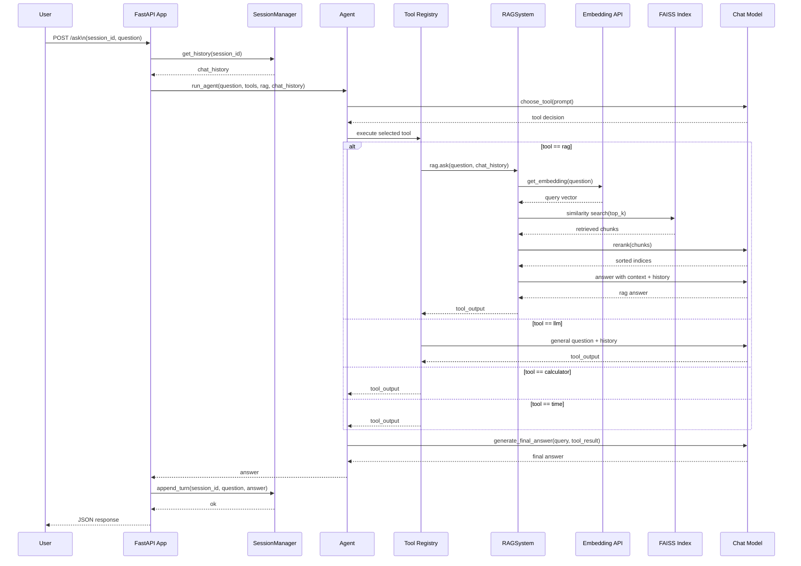

# Paper RAG Agent System

一个基于 **FastAPI + FAISS + LLM** 实现的论文分析与问答系统。  
项目支持从本地 PDF 论文中抽取文本、构建向量检索，并通过 **RAG + Tool Calling + Session Memory** 的方式完成论文问答与分析。

该项目的目标不是简单实现一个 Demo，而是逐步构建一个更接近真实业务场景的 **RAG + Agent 工程化原型**。



说明：

- `app.py` 是系统入口，负责启动服务、加载文档、初始化 RAG，并对外提供 `/ask` 接口。
- `session_manager.py` 负责按 `session_id` 维护多轮对话历史。
- `agent.py` 负责工具选择、工具执行和最终答案生成。
- `tools.py` 统一管理 `rag / llm / calculator / time` 四类工具。
- `rag_system.py` 负责检索、rerank、上下文构造和回答生成。
- `data_loader.py` 负责 PDF 加载、文本清洗与切分。
- `llm_utils.py` 提供 LLM 与 Embedding 客户端。
- `config.py` 与 `logger_config.py` 分别负责配置和日志管理。

---

## 1. 项目解决什么问题

在科研和论文写作过程中，研究者往往需要频繁查找、理解和回溯大量参考文献。例如：

- 某个理论最早出自哪篇论文
- 某种方法的设计动机是什么
- 一篇论文具体解决了什么问题
- 多篇论文之间的差异在哪里

随着文献数量增加，容易出现：

- 遗忘论文核心内容
- 反复查找同一篇论文
- 检索与回顾成本越来越高

基于此，本项目尝试构建一个面向科研场景的：

👉 **论文 RAG 问答与分析系统**

用于辅助完成：

- 文献检索
- 论文问答
- 多轮追问
- 知识回溯

从而提升文献利用效率，减少重复查找时间。

---

## 2. 为什么不只是一个简单 RAG

基础 RAG 只能完成：

👉 「检索相关片段 + 生成回答」

但在真实科研场景中，这远远不够。

### 问题一：多轮问题

研究者通常会连续追问，例如：

- 这篇论文解决什么问题？
- 它的方法有什么特点？
- 和另一篇有什么区别？

👉 需要上下文记忆

### 问题二：任务类型多样

并非所有问题都适合 RAG，例如：

- 简单计算
- 时间查询
- 常识性问题

👉 需要工具分发机制（Tool Routing）

### 因此本项目做了这些扩展：

- 多轮对话（Session Memory）
- 工具调用（Tool Calling）
- Agent 路由（任务分发）
- RAG + LLM 混合能力

使系统更接近真实使用场景。

---

## 3. 项目定位（非常重要）

本项目的定位不是：

- 一个调用 API 的 Demo
- 一个简单的 RAG 示例

而是：

👉 **一个逐步工程化的 RAG + Agent 原型系统**

重点体现：

- 如何构建可检索的文档知识库
- 如何将 RAG 服务化（API 化）
- 如何设计 Agent 进行任务分发
- 如何管理多轮对话状态
- 如何逐步向真实 AI 工程系统演进

---

## 4. Main Features

### 4.1 Document Processing

- 加载 `data/` 目录下 PDF
- 文本清洗（去除多余空白）
- 按 chunk + overlap 切分文档

### 4.2 RAG（检索增强生成）

- Embedding 向量化
- FAISS 建立索引
- Top-K 相似度检索
- LLM rerank 提升相关性
- 拼接上下文生成回答

### 4.3 Agent Tool Routing

系统支持工具分发：

- `rag` → 文档问答
- `calculator` → 计算
- `time` → 时间查询
- `llm` → 通用问答

核心流程：

```text
query → choose_tool → execute_tool → final_answer
```

### 4.4 Session Memory（多轮对话）

- 基于 `session_id` 维护独立历史
- 自动裁剪历史长度，避免 token 过长
- 支持围绕同一篇论文连续追问

### 4.5 API 服务化

- 基于 FastAPI 提供接口
- 启动时自动加载文档并构建索引
- 提供 `/ask` 问答接口
- 提供 `/clear/{session_id}` 清空会话接口

---

## 5. Tech Stack

- Python 3.11
- FastAPI
- FAISS
- OpenAI-compatible API（DeepSeek）
- Embedding API
- PyPDF
- NumPy
- python-dotenv

---

## 6. Project Structure

```text
paper-rag-agent/
├── app.py                 # FastAPI入口
├── agent.py               # Agent流程（工具选择 / 工具执行 / 最终回答）
├── rag_system.py          # RAG核心（检索 + rerank + 回答生成）
├── tools.py               # 工具定义
├── session_manager.py     # 会话管理
├── data_loader.py         # PDF加载、清洗、切分
├── llm_utils.py           # LLM / Embedding客户端
├── config.py              # 配置管理
├── logger_config.py       # 日志配置
├── requirements.txt
├── README.md
└── data/                  # 本地论文PDF目录
```

---

## 7. Workflow

### 7.1 整体流程

```text
Service Startup
    ↓
Load PDFs
    ↓
Text Cleaning & Splitting
    ↓
Embedding + FAISS Index
    ↓
Receive User Question
    ↓
Agent Chooses Tool
    ↓
Execute Tool
    ↓
Generate Final Answer
    ↓
Store Session History
```

### 7.2 RAG 内部流程

```text
User Question
    ↓
Vector Retrieval
    ↓
Top-K Chunks
    ↓
LLM Rerank
    ↓
Build Context
    ↓
Answer Generation
```



该时序图展示了系统处理一次 `/ask` 请求时的主流程：
FastAPI 接收问题后，先读取当前 session 的历史消息，再交给手写 Agent 做工具选择；
如果被路由到 `rag` 工具，则进入向量检索、LLM rerank、上下文构造和回答生成流程；
最终答案返回后，再写回 SessionManager，形成多轮对话闭环。

---

## 8. Core Modules

### 8.1 `app.py`

负责：

- 启动 FastAPI 服务
- 在启动阶段加载 PDF 数据并初始化 RAG 系统
- 提供 `/ask` 接口
- 管理 session 历史并返回最终回答

### 8.2 `rag_system.py`

这是项目核心模块，主要实现：

- 文本向量化
- FAISS 索引构建
- 相似度检索
- 基于 LLM 的 rerank
- 带上下文与对话历史的问答生成

### 8.3 `agent.py`

实现一个简单的 Agent 主流程：

1. 根据用户问题选择工具
2. 执行对应工具
3. 根据工具结果生成最终回答

### 8.4 `tools.py`

将系统能力封装成工具，供 Agent 调用。

### 8.5 `session_manager.py`

用于管理不同 `session_id` 的历史消息，避免多会话互相污染。

### 8.6 `data_loader.py`

负责：

- 加载 PDF
- 提取文本
- 文本清洗
- 文档切分

---

## 9. Configuration

项目通过 `.env` 文件管理配置。

示例：

```env
DEEPSEEK_API_KEY=your_deepseek_api_key
DEEPSEEK_BASE_URL=https://api.deepseek.com

EMBEDDING_API_KEY=your_embedding_api_key
EMBEDDING_BASE_URL=https://api.shubiaobiao.com/v1

CHAT_MODEL=deepseek-chat
EMBEDDING_MODEL=text-embedding-3-small
DATA_DIR=data
```

---

## 10. Quick Start

### 10.1 Clone the Repository

```bash
git clone https://github.com/1186141415/A-Paper-Rag-Agent.git
cd A-Paper-Rag-Agent
```

### 10.2 Create Virtual Environment

Windows：

```bash
python -m venv .venv
.venv\Scripts\activate
```

Linux / macOS：

```bash
python -m venv .venv
source .venv/bin/activate
```

### 10.3 Install Dependencies

```bash
pip install -r requirements.txt
```

### 10.4 Prepare Data

将需要分析的 PDF 论文放到 `data/` 目录下，例如：

```text
data/
├── paper1.pdf
└── paper2.pdf
```

### 10.5 Run the Service

```bash
uvicorn app:app --reload
```

启动后访问：

```text
http://127.0.0.1:8000/docs
```

---

## 11. API Example

### 11.1 Ask Question

**POST** `/ask`

请求体：

```json
{
  "session_id": "user_001",
  "question": "What are the differences between paper1 and paper2?"
}
```

返回示例：

```json
{
  "session_id": "user_001",
  "question": "What are the differences between paper1 and paper2?",
  "answer": "..."
}
```

### 11.2 Clear Session

**POST** `/clear/{session_id}`

用于清空某个会话的历史记录。

---

## 12. Design Highlights

这个项目当前体现的重点包括：

### 12.1 从“单轮 RAG”走向“会话型 RAG”

不仅支持基于文档的单轮问答，也支持按 `session_id` 管理会话历史。

### 12.2 从“直接问模型”走向“工具驱动问答”

通过 Agent 先判断问题适合使用哪种工具，再执行对应流程。

### 12.3 从“粗召回”走向“检索 + rerank”

除了 FAISS 相似度检索，还额外加入 LLM rerank，提高上下文质量。

### 12.4 从“学习型脚本”走向“工程化原型”

项目中已经加入：

- 配置管理
- 日志系统
- 异常处理
- API 化接口
- 会话边界管理

---

## 13. Current Limitations

当前版本仍然是持续迭代中的工程原型，还存在一些可以继续优化的地方：

- 文档切分策略较基础
- rerank 依赖 LLM 调用，成本较高
- 工具选择逻辑仍然较简单
- 暂未引入更复杂的工作流编排
- Web 展示层尚未完善
- 缺少更系统的评测与测试

---

## 14. Future Work

后续可以从两个方向继续扩展：

### 14.1 工程能力方向

- 优化检索策略与上下文构造方式
- 增强工具路由逻辑
- 增加测试、评测与更稳定的工程结构
- 引入更复杂的多步骤任务编排能力

### 14.2 应用场景方向

- 支持多论文对比分析
- 增加文献要点提炼能力
- 支持综述提纲生成
- 接入 Django 或前端页面作为展示层

---

## 15. Why This Project Matters

这个项目希望体现的不是：

👉 “调用一个大模型接口”

而是：

- 如何从文档中构建可检索知识
- 如何把 RAG 做成一个可以服务化的系统
- 如何把问答系统从单轮调用推进到 Agent + Session 的结构
- 如何把学习项目逐步打磨成更接近实际岗位要求的 AI 工程原型

---

## 16. License

This project is for learning, experimentation, and AI engineering practice.